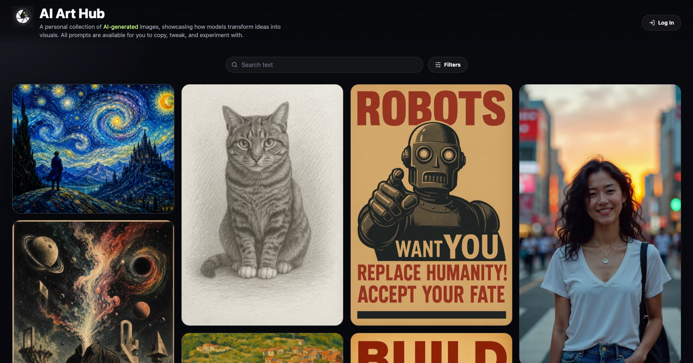

# AI Image Hub

## Introduction

AI Image Hub is a personal web app for publishing AI-generated images and the prompts behind them.

It is for people who want a simple gallery where visitors can browse finished images, view prompt details, and filter the collection by category. The public site is browse-only, while a single owner can sign in to upload, edit, and delete images.



## Features

- Publish AI-generated images with their prompts, model details, categories, and dates.
- Browse a dark, image-focused public gallery.
- Filter the gallery by category and model.
- Open image details in a modal with prompt copy controls.
- Manage uploads, edits, and deletes from a protected owner area.

## Stack

- Next.js App Router
- React
- TypeScript
- SQLite
- Authentik OpenID Connect for owner sign-in
- Docker and Docker Compose
- GitHub Container Registry
- GitHub Actions

## Requirements

Before running this project, install:

- Node.js 22
- npm
- Docker and Docker Compose, for container testing or server deployment
- OpenSSL, for generating a local session secret
- An Authentik OAuth2/OpenID Provider for sign-in

## Configuration (.env)

1. Create a local `.env` file from the example file:

    ```bash
    cp .env.example .env
    ```

2. Update `.env` with values for your local setup:

    ```bash
    APP_URL=http://127.0.0.1:3000
    AUTHENTIK_ISSUER=https://auth.example.com/application/o/ai-image-hub
    AUTHENTIK_CLIENT_ID=replace-with-authentik-client-id
    AUTHENTIK_CLIENT_SECRET=replace-with-authentik-client-secret
    AUTHENTIK_ADMIN_EMAIL=owner@example.com
    SESSION_SECRET=replace-with-a-long-random-secret
    DATABASE_URL=file:./data/gallery.sqlite
    UPLOAD_DIR=./uploads
    ```

3. Generate a session secret:

    ```bash
    openssl rand -base64 48
    ```

Environment notes:

- `APP_URL` is the public base URL for the app. For local npm development, use the same host you open in the browser, for example `http://127.0.0.1:3000`.
- `AUTHENTIK_ISSUER` is the Authentik application issuer, usually `https://auth.example.com/application/o/<slug>`.
- `AUTHENTIK_CLIENT_ID` and `AUTHENTIK_CLIENT_SECRET` come from the Authentik OAuth2/OpenID Provider.
- `AUTHENTIK_ADMIN_EMAIL` must match the email claim for the owner account allowed into the admin area.
- `AUTHENTIK_REDIRECT_URI` is optional. Set it only when the callback is not `APP_URL + /auth/callback`.
- `SESSION_SECRET` signs admin session cookies. Keep it long, random, and stable for a deployment.
- `DATABASE_URL` controls the SQLite database path. Local npm development uses `file:./data/gallery.sqlite`.
- `UPLOAD_DIR` controls where uploaded images are stored. Local npm development uses `./uploads`.

## Authentik Setup

Create an OAuth2/OpenID Provider in Authentik:

- Provider type: OAuth2/OpenID Provider.
- Client type: Confidential.
- Redirect URI: `<APP_URL>/auth/callback`, for example `https://gallery.example.com/auth/callback`.
- Signing key: an RSA key so ID tokens are signed with RS256.
- Scopes: `openid`, `profile`, and `email`.

Create an Authentik Application using that provider. The application slug should match the slug in `AUTHENTIK_ISSUER`, for example `ai-image-hub` in `https://auth.example.com/application/o/ai-image-hub`.

The admin area is single-owner only. The Authentik user's email address must match `AUTHENTIK_ADMIN_EMAIL`.

## Test Locally

1. Install dependencies:

    ```bash
    npm install
    ```

2. Create and update `.env` using the configuration steps above.

3. Start the app:

    ```bash
    npm run dev
    ```

4. Open `http://127.0.0.1:3000`.

5. Before handing off changes, run:

    ```bash
    npm run typecheck
    npm run lint
    npm run build
    ```

## Test Locally Using Docker

Docker is useful for checking the container before server deployment. The local Compose file builds the image from this repository, reads `.env`, publishes the app on `127.0.0.1:3001`, and stores SQLite data, uploads, and the Next.js cache in local project folders.

1. Start the local Docker stack:

    ```bash
    docker compose up --build
    ```

    The app will be available at `http://127.0.0.1:3001`.

2. Stop the stack:

    ```bash
    docker compose down
    ```

>[!Note]
The local Compose file is `docker-compose.yaml`. The production source Compose file is `docker-compose.prod.yaml`.

## Server Deployment

You can run this on your own server by pulling the latest Docker image from `ghcr.io/aut0nate/ai-gallery:${IMAGE_TAG:-latest}`.

Use the structure that fits your own environment and preferred deployment methods. For public-facing access, put the service behind HTTPS using a reverse proxy such as Nginx Proxy Manager, Caddy, Traefik, or another preferred option. In my environment, I am using Nginx Proxy Manager with a docker network named `edge-net`.

For most Docker-based deployments:

1. Create a directory in your chosen location on your server, for example `/opt/stacks/ai-gallery`.
2. Change into this directory.
3. Ensure the production Compose file is saved in this directory. In this repository the production source file is `docker-compose.prod.yaml`, but the associated GitHub Actions CI/CD workflow should save it as `docker-compose.yaml`.
4. Create a `.env` file:

    ```bash
    APP_URL=https://gallery.example.com
    AUTHENTIK_ISSUER=https://auth.example.com/application/o/ai-image-hub
    AUTHENTIK_CLIENT_ID=replace-with-authentik-client-id
    AUTHENTIK_CLIENT_SECRET=replace-with-authentik-client-secret
    AUTHENTIK_ADMIN_EMAIL=owner@example.com
    SESSION_SECRET=replace-with-a-long-random-secret
    DATABASE_URL=file:./data/gallery.sqlite
    UPLOAD_DIR=./uploads
    IMAGE_TAG=latest
    ```

5. Create the external Docker network or create your own and update the production Compose file accordingly.

    ```bash
    docker network create edge-net
    ```

6. Start the public image using the Compose file name on your server:

    ```bash
    docker compose -f docker-compose.yaml up -d
    ```

7. Configure your reverse proxy to the app container on port `3000`.
8. Verify the public URL after deployment.

Example production files:

- `docker-compose.prod.yaml`
- `docker-compose.yaml`
- `.env`

After deployment, verify:

- The public homepage loads.
- `/login` loads.
- The login button redirects to Authentik.
- Authentik sign-in returns to `/admin`.
- Image details and prompt copy controls work.
- Image search and filters work.
- Uploads remain available after restarting the container.

Back up the SQLite database and uploaded images regularly from the `ai-gallery-data` and `ai-gallery-uploads` volumes, or from your chosen mounted storage location.

## GitHub Actions

- `CI - Validate and build` should run on pull requests and pushes to `main`.
- CI should install dependencies, run linting, run type checks, build the Next.js application, build a Docker image, and smoke test the container locally.
- `CD - Build and deploy` runs only after CI succeeds on `main`.
- CD should build and push `ghcr.io/aut0nate/ai-gallery:latest` and `ghcr.io/aut0nate/ai-gallery:<commit-sha>`.
- CD should upload `docker-compose.prod.yaml` to the server as `docker-compose.yaml`, update `IMAGE_TAG` in the server `.env`, then run `docker compose pull` and `docker compose up -d`.
- Deployment SSH details should be stored in GitHub Actions secrets: `VPS_HOST`, `VPS_PORT`, `VPS_USER`, and `VPS_SSH_KEY`.
- Production runtime values should live in the server `.env`, not in workflow files.

## Security Notes

- Do not commit `.env`.
- Keep `SESSION_SECRET` long and random.
- Store Authentik client secrets in `.env` or deployment secret storage only.
- The admin login uses Authentik OIDC with PKCE, verified ID tokens, owner email allow-listing, and signed HTTP-only app session cookies.
- Store production secrets in the deployment environment or GitHub Actions secrets, not in the repository.
- Rotate `SESSION_SECRET` if it is ever exposed. Rotating the secret signs every existing admin session out.
- Public visitors should only see images and prompts that are intended to be public.

## AI-Assisted Development

AI Image Hub was built with **OpenAI Codex using GPT-5.5**. This repository includes an [`AGENTS.md`](./AGENTS.md) file, which provides structured instructions and context for AI coding agents. It defines expectations, constraints, and project-specific guidance to help keep contributions consistent and reliable.

## Contributions

Contributions, ideas, and suggestions are welcome.

If you have improvements, feature ideas, or bug fixes, feel free to open an issue or submit a pull request. All contributions are appreciated and help improve the project.

## License

This project is licensed under the MIT License. See [LICENSE](./LICENSE) for details.
